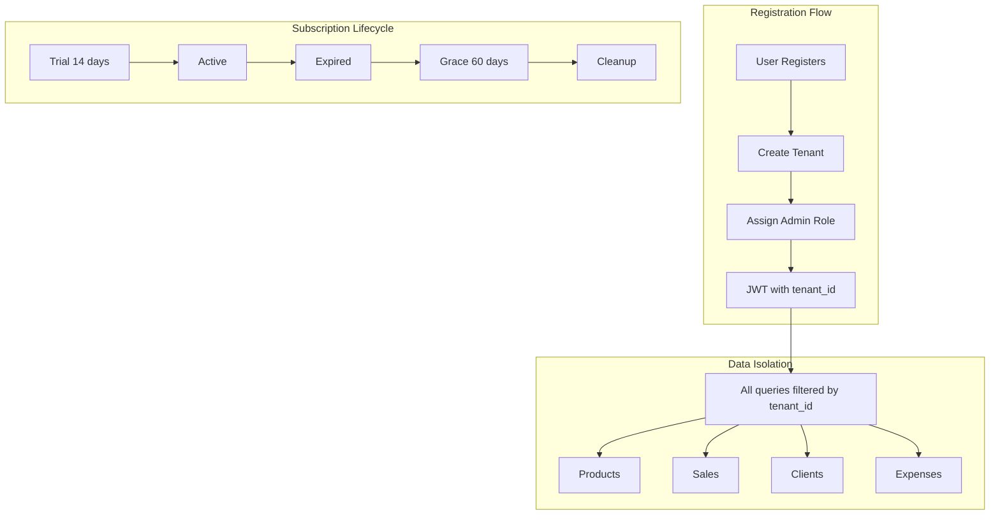

# Multi-Tenancy Implementation Walkthrough

## Overview

VanPOS now supports **multi-tenancy** where each business operates in complete data isolation. This enables a SaaS model where multiple customers share the same application infrastructure.

## Architecture



---

## Database Changes

### New Models

#### [Tenant](file:///Users/eolivan/Projects/EO/Meditrib/backend/core/models.py#L11-L28)
| Field | Type | Description |
|-------|------|-------------|
| name | str | Business name |
| slug | str | URL-friendly ID |
| subscription_status | str | trial/active/expired/cancelled |
| subscription_ends_at | datetime | When subscription expires |
| grace_period_ends_at | datetime | 60 days after expiry |

#### [TenantInvitation](file:///Users/eolivan/Projects/EO/Meditrib/backend/core/models.py#L31-L47)
For inviting team members to join a tenant.

### Modified Models
`tenant_id` added to all data models:
- Product, ProductTag, Inventory
- Client, Sale, SaleItem
- Supplier, PurchaseOrder
- Expense, ExpenseCategory
- Alert, Invoice, Company, AppSettings

---

## Backend Changes

### JWT Token ([auth.py](file:///Users/eolivan/Projects/EO/Meditrib/backend/routers/auth.py))
Now includes:
```json
{
  "sub": "user@email.com",
  "tenant_id": 1,
  "is_owner": true,
  "exp": 1703347200
}
```

### Router Updates
All routers now use `get_tenant_id()` dependency:

```python
def get_tenant_id(current_user = Depends(get_current_user)) -> int:
    if not current_user.tenant_id:
        raise HTTPException(403, "Not associated with tenant")
    return current_user.tenant_id
```

**Updated routers:**
- [products.py](file:///Users/eolivan/Projects/EO/Meditrib/backend/routers/products.py)
- [clients.py](file:///Users/eolivan/Projects/EO/Meditrib/backend/routers/clients.py)
- [sales.py](file:///Users/eolivan/Projects/EO/Meditrib/backend/routers/sales.py)
- [suppliers.py](file:///Users/eolivan/Projects/EO/Meditrib/backend/routers/suppliers.py)
- [expenses.py](file:///Users/eolivan/Projects/EO/Meditrib/backend/routers/expenses.py)
- [alerts.py](file:///Users/eolivan/Projects/EO/Meditrib/backend/routers/alerts.py)
- [product_tags.py](file:///Users/eolivan/Projects/EO/Meditrib/backend/routers/product_tags.py)
- [onboarding.py](file:///Users/eolivan/Projects/EO/Meditrib/backend/routers/onboarding.py)

### New Files

| File | Purpose |
|------|---------|
| [tenants.py](file:///Users/eolivan/Projects/EO/Meditrib/backend/routers/tenants.py) | Team management, invitations |
| [password.py](file:///Users/eolivan/Projects/EO/Meditrib/backend/core/password.py) | Password hashing (avoids circular imports) |
| [cleanup.py](file:///Users/eolivan/Projects/EO/Meditrib/backend/tasks/cleanup.py) | Expired tenant data cleanup |

---

## API Endpoints

### Tenant Management
| Method | Endpoint | Description |
|--------|----------|-------------|
| GET | `/api/v1/tenants/me` | Get current tenant |
| PUT | `/api/v1/tenants/me` | Update tenant name |
| GET | `/api/v1/tenants/members` | List team members |
| POST | `/api/v1/tenants/invite` | Invite team member |
| GET | `/api/v1/tenants/invitations` | List pending invites |

---

## Usage

### Fresh Database Setup
```bash
rm backend/vanpos.db
make backend
```

### Cleanup Expired Tenants
```bash
# Dry run (preview only)
python -m backend.tasks.cleanup

# Execute deletion
python -m backend.tasks.cleanup --execute
```

---

## Subscription Flow

1. **Registration** → Creates tenant with `trial` status (14 days)
2. **Trial ends** → Status becomes `expired`
3. **Grace period** → 60 days to renew, read-only access
4. **Cleanup** → Data deleted after grace period

---

## Security

- All data queries filtered by `tenant_id`
- Tenant A cannot see Tenant B's data
- Owner role required for team management
- Expired tenants blocked from write operations
